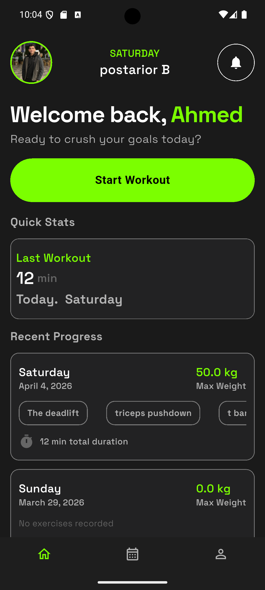
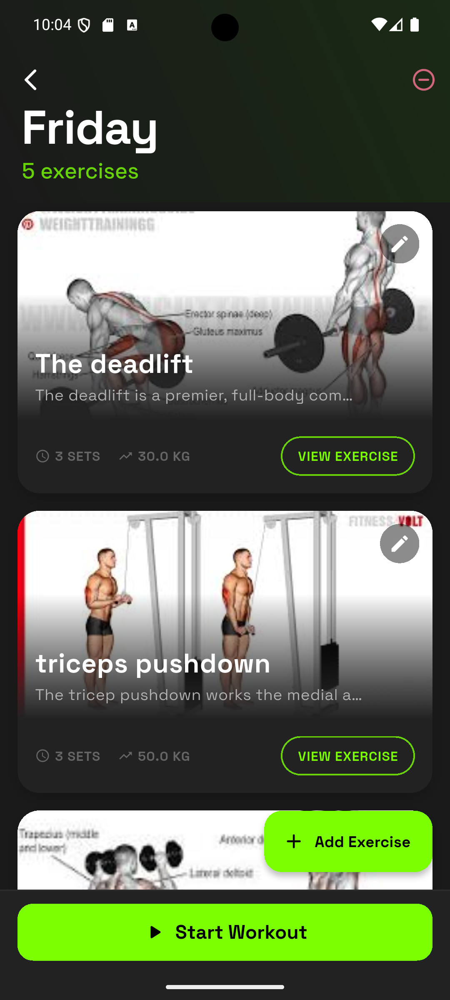
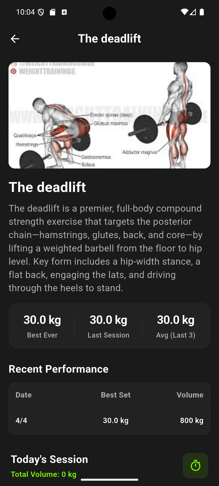
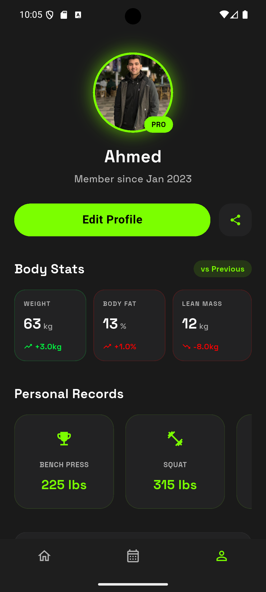
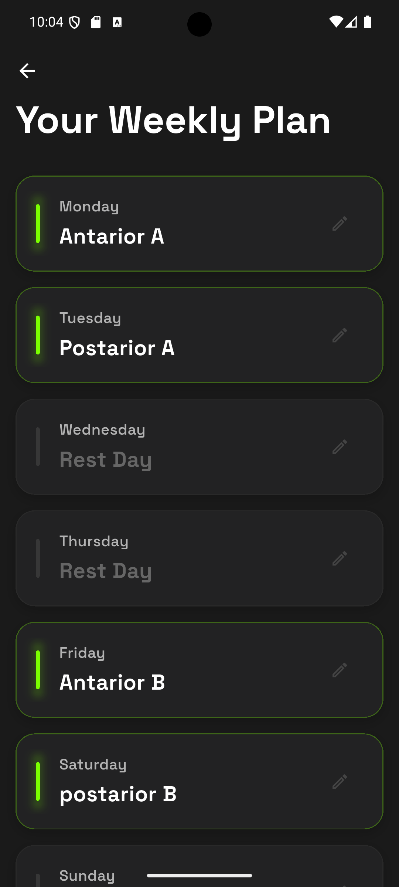
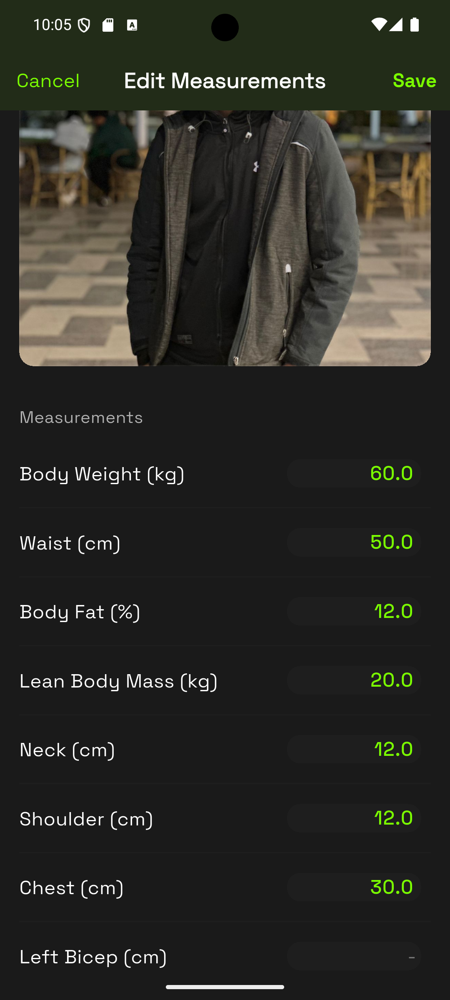
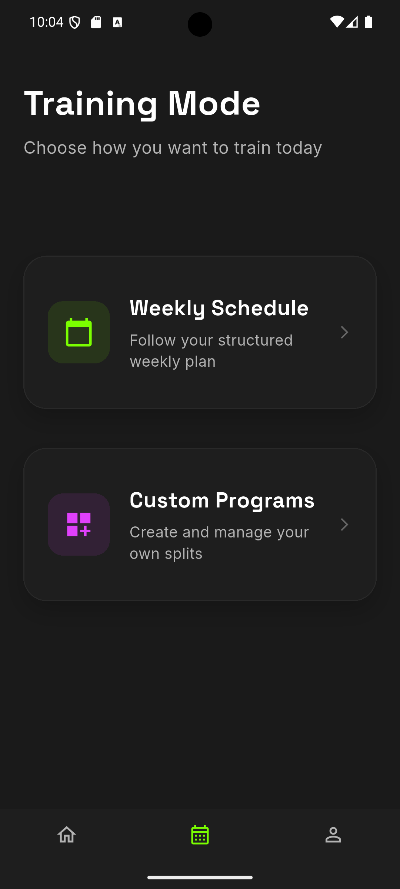

# 🏋️‍♂️ Gym Progress Tracker (Hobix)

A premium, modern Flutter application designed to be your **Personal Gym OS**. Hobix helps athletes train smarter, track everything, and grow stronger with an intuitive, glassmorphic dark-themed interface.

## 📱 App Experience

<div align="center">
  <table>
    <tr>
      <td align="center"><b>Home Dashboard</b></td>
      <td align="center"><b>Training Day Detail</b></td>
      <td align="center"><b>Exercise Tracking</b></td>
      <td align="center"><b>Profile Statistics</b></td>
    </tr>
    <tr>
      <td></td>
      <td></td>
      <td></td>
      <td></td>
    </tr>
    <tr>
      <td align="center"><b>Weekly Schedule</b></td>
      <td align="center"><b>Measurements</b></td>
      <td align="center"><b>Page Switcher</b></td>
      <td align="center"></td>
    </tr>
    <tr>
      <td></td>
      <td></td>
      <td></td>
      <td></td>
    </tr>
  </table>
</div>

---

## ✨ Key Features

### 🚀 First-Time User Setup Flow
- **Personalized Onboarding:** A smooth, animated 5-step `PageView` collecting the user's Name, Age, Gender (with custom SVGs), Weight, and Fitness Goals.
- **Smart Initialization:** Automatically logs the initial weight as the first entry in the Measurement history and remembers the user securely using `SharedPreferences`.

### 📊 Comprehensive Measurements Tracking
- **Body & Tape Metrics:** Log over 17 distinct optional body measurements (Body Weight, Body Fat %, Lean Mass, Biceps, Chest, Calves, etc.).
- **Progress Pictures:** Integrated image picker allows users to upload side-by-side progress photos saved securely to the local device storage.
- **Historical List:** View past entries organized chronologically on the Measures page.

### 🗓️ Workout History & Calendar
- **Interactive Calendar:** Built with `table_calendar` to visualize activity streaks, rest days, and workout frequencies at a glance.
- **Daily Summaries:** Tap on any highlighted day to see exactly which workout route or exercises were completed.

### ⏱️ Advanced Workout Session Engine
- **Holistic Day Tracking:** Record the **total duration** of your entire workout, from the first "Start Workout" to the final "Finish" button.
- **Auto-Syncing Dashboard:** The Home Screen automatically refreshes upon completing a session, giving you instant gratification with updated "Total Minutes" and "Last Workout" data.
- **Live Timer:** Persistent backround timer managed via `WorkoutTimerCubit` with integrated state preservation.

### 🗺️ Dynamic UI & Content Management
- **Edit on the Fly:** Modify exercise names, sets, or images directly from the training day detail view using the new `EditExerciseSheet`.
- **Cancel Days:** Life happens. Easily revert a planned training day back to a **Rest Day** with the "Cancel Day" feature, which clears the schedule safely.
- **Multi-Image Support:** Every exercise can now hold a gallery of reference images for better form guidance.

### 🎨 Fully Responsive & Premium Aesthetics
- **Pixel-Perfect Consistency:** Every font size, padding, and icon is precisely scaled for any screen resolution using the `flutter_screenutil` engine.
- **Glassmorphic Theme:** Stunning dark mode with translucent background blur panels, neon accents, and smooth `AnimatedSwitcher` transitions.
- **Dynamic Dashboard:** Real-time calculation of weekly workout frequency and lifetime exercise duration.

---

## 🏗️ Architecture & Tech Stack

This project strictly adheres to **Clean Architecture** principles, ensuring scalability, testability, and separation of concerns.

### 📂 Layered Directory Structure
1. **Domain Layer:** Contains core business logic, `Entities`, and `UseCases`. Totally independent of external packages.
2. **Data Layer:** Contains `Models` (Hive adapters), `Repositories` implementations, and local `DataSources`.
3. **Presentation Layer:** Contains UI components (`Widgets`, `Screens`) and State Management (`Cubits`, `Blocs`).

### 🛠️ Core Technologies Used
* **Framework:** [Flutter](https://flutter.dev/) (Dart)
* **State Management:** `flutter_bloc` & `equatable`
* **Dependency Injection:** `get_it`
* **Local Database / Storage:** `hive` & `hive_flutter` for blazing-fast NoSQL local persistence. `shared_preferences` for lightweight flags.
* **Functional Programming:** `dartz` for Either types and robust error handling.
* **UI Design & Animations:** `flutter_screenutil` (responsive sizing), `google_fonts` (Space Grotesk typography), `flutter_svg`, and custom implicitly animated widgets.
* **Utilities:** `image_picker`, `path_provider`, `table_calendar`, `intl`, `uuid`.

---

## 🏃 Getting Started

### Prerequisites
* Flutter SDK (`^3.10.4` or higher)
* Dart SDK

### Installation

1. **Clone the repository**
   ```bash
   git clone https://github.com/your-username/try_my_tracker.git
   cd try_my_tracker
   ```

2. **Fetch Dependencies**
   ```bash
   flutter pub get
   ```

3. **Generate Hive Adapters & Code**
   Because this project uses Hive for local data storage, you must run the build runner to generate the database models before launching:
   ```bash
   dart run build_runner build --delete-conflicting-outputs
   ```

4. **Run the App**
   ```bash
   flutter run
   ```

---

## 🎨 Design Philosophy
Hobix is built with an unapologetic focus on **Aesthetics and Usability**. 
- Deep `AppColors.background` (Dark theme) eliminates eye strain.
- Neon `AppColors.primary` (Green) accents draw focus to Call-to-Actions.
- Background glow orbs and glassmorphic translucent panels (`Container` with low alpha values and blurs) provide a futuristic **Gym OS** feel.

---
*Developed with clean code and heavy lifting. Ready for production.* 🚀
